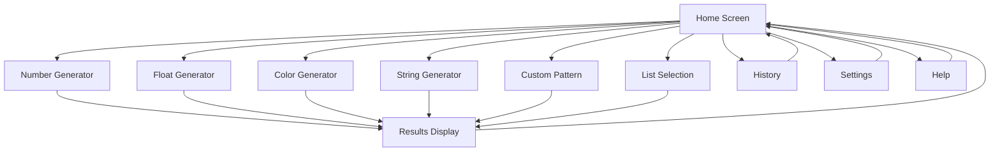
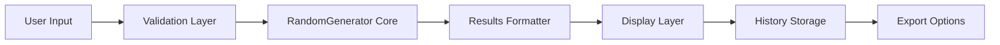

# TUI Mode Improvement Plan
## Random Value Generator - Enhanced Text User Interface

---

## Executive Summary

This plan outlines the comprehensive improvement of the TUI (Text User Interface) mode for the Random Value Generator application. The current TUI uses basic print statements and input prompts. The improved version will leverage the **Textual framework** to create a modern, reactive, and visually appealing terminal interface with enhanced user experience.

---

## Current State Analysis

### Existing TUI Implementation

The current [`TUI`](random_gen.py:162) class provides:
- Basic menu-driven interface with numbered options
- Simple input prompts with default values
- Sequential screen clearing using newlines
- Six generation modes (numbers, floats, colors, strings, custom patterns, lists)
- Basic error handling with try-catch blocks

### Current Limitations

1. **Visual Design**
   - No colors or styling
   - Poor visual hierarchy
   - Screen clearing is crude (prints 50 newlines)
   - No visual feedback during operations
   - Results display is plain text

2. **User Experience**
   - Linear navigation only (no back button)
   - No keyboard shortcuts
   - Must complete or exit each operation
   - No input validation until submission
   - No preview of results before generation

3. **Functionality**
   - No history of previous generations
   - Cannot save/load presets
   - No batch operations
   - Limited help/documentation within TUI
   - No copy-to-clipboard functionality

---

## Proposed Solution: Textual Framework

### Why Textual?

[Textual](https://textual.textualize.io/) is a modern Python framework for building sophisticated terminal user interfaces:

**Advantages:**
- ✅ Reactive and event-driven architecture
- ✅ Rich styling with CSS-like syntax
- ✅ Built-in widgets (buttons, inputs, tables, etc.)
- ✅ Keyboard and mouse support
- ✅ Responsive layouts
- ✅ Animation support
- ✅ Cross-platform compatibility
- ✅ Active development and good documentation
- ✅ Pure Python (no C dependencies)

**Considerations:**
- Requires external dependency (will add fallback to current TUI)
- Learning curve for development team
- Slightly larger memory footprint

---

## Architecture Design

### Component Structure

```
TextualTUI (Main App)
├── HeaderWidget (App title, version, status)
├── NavigationWidget (Sidebar with menu items)
├── ContentContainer (Main content area)
│   ├── HomeScreen (Welcome and quick actions)
│   ├── NumberGeneratorScreen
│   ├── FloatGeneratorScreen
│   ├── ColorGeneratorScreen
│   ├── StringGeneratorScreen
│   ├── CustomPatternScreen
│   ├── ListSelectionScreen
│   ├── ResultsScreen (Display and manage results)
│   ├── HistoryScreen (Previous generations)
│   ├── SettingsScreen (User preferences)
│   └── HelpScreen (Documentation)
├── FooterWidget (Keyboard shortcuts, hints)
└── NotificationSystem (Toast messages, alerts)
```

### Screen Flow Diagram



### Data Flow



---

## Detailed Feature Specifications

### 1. Visual Design & Layout

#### Color Scheme
- **Primary**: Cyan/Blue tones for headers and highlights
- **Secondary**: Green for success states
- **Accent**: Yellow/Orange for warnings
- **Error**: Red for error states
- **Background**: Dark theme with subtle gradients
- **Text**: High contrast white/light gray

#### Layout Structure
```
┌─────────────────────────────────────────────────────────────┐
│ 🎲 Random Value Generator v1.0              [Settings] [?] │ Header
├──────────┬──────────────────────────────────────────────────┤
│          │                                                  │
│  Menu    │           Main Content Area                     │
│          │                                                  │
│ • Home   │  [Dynamic content based on selected screen]     │
│ • Number │                                                  │
│ • Float  │                                                  │
│ • Color  │                                                  │
│ • String │                                                  │
│ • Custom │                                                  │
│ • List   │                                                  │
│ ─────    │                                                  │
│ • History│                                                  │
│ • Help   │                                                  │
│          │                                                  │
├──────────┴──────────────────────────────────────────────────┤
│ ↑↓: Navigate  Enter: Select  Esc: Back  Ctrl+C: Exit       │ Footer
└─────────────────────────────────────────────────────────────┘
```

### 2. Navigation System

#### Keyboard Shortcuts
- **Arrow Keys / hjkl**: Navigate menu items and fields
- **Tab / Shift+Tab**: Move between input fields
- **Enter**: Confirm selection / Generate
- **Esc**: Go back / Cancel
- **Ctrl+C**: Exit application
- **Ctrl+H**: Show help
- **Ctrl+S**: Open settings
- **Ctrl+R**: View history
- **Ctrl+G**: Quick generate (with last settings)
- **F1-F6**: Quick access to generator types

#### Mouse Support
- Click to select menu items
- Click to focus input fields
- Scroll in results area
- Click buttons for actions

### 3. Screen Implementations

#### Home Screen
```
┌─────────────────────────────────────────────────────────────┐
│                   Welcome to Random Generator                │
│                                                              │
│  Quick Actions:                                              │
│  ┌──────────────┐  ┌──────────────┐  ┌──────────────┐      │
│  │   Numbers    │  │    Colors    │  │   Strings    │      │
│  │   🎲 1-100   │  │   🎨 #HEX    │  │   📝 A-Z0-9  │      │
│  └──────────────┘  └──────────────┘  └──────────────┘      │
│                                                              │
│  Recent Generations:                                         │
│  • 42, 17, 89 (Numbers, 2 min ago)                          │
│  • #ff5733, #33c4ff (Colors, 5 min ago)                     │
│                                                              │
│  Tip: Press F1-F6 for quick access to generators            │
└─────────────────────────────────────────────────────────────┘
```

#### Number Generator Screen
```
┌─────────────────────────────────────────────────────────────┐
│                    Generate Numbers                          │
│                                                              │
│  Minimum Value:  [1        ]  ◄ Use ↑↓ or type             │
│  Maximum Value:  [100      ]                                │
│  Count:          [5        ]                                │
│  Exclude:        [13,7,42  ]  (comma-separated)            │
│                                                              │
│  Preview Range: 1 to 100 (excluding 3 values)               │
│  Available: 97 numbers                                       │
│                                                              │
│  ┌──────────────┐  ┌──────────────┐                        │
│  │   Generate   │  │     Clear    │                        │
│  └──────────────┘  └──────────────┘                        │
│                                                              │
│  Results:                                                    │
│  ┌────────────────────────────────────────────────────────┐ │
│  │ 42, 17, 89, 3, 56                                      │ │
│  │                                                        │ │
│  │ [Copy to Clipboard] [Save to History] [Export]        │ │
│  └────────────────────────────────────────────────────────┘ │
└─────────────────────────────────────────────────────────────┘
```

#### Color Generator Screen
```
┌─────────────────────────────────────────────────────────────┐
│                    Generate Colors                           │
│                                                              │
│  Format:  ○ HEX    ○ RGB    ○ HSL                           │
│  Count:   [5        ]                                        │
│                                                              │
│  ┌──────────────┐  ┌──────────────┐                        │
│  │   Generate   │  │     Clear    │                        │
│  └──────────────┘  └──────────────┘                        │
│                                                              │
│  Results:                                                    │
│  ┌────────────────────────────────────────────────────────┐ │
│  │ ██ #ff5733  ██ #33c4ff  ██ #8e44ad                    │ │
│  │ ██ #2ecc71  ██ #f39c12                                 │ │
│  │                                                        │ │
│  │ #ff5733                                                │ │
│  │ #33c4ff                                                │ │
│  │ #8e44ad                                                │ │
│  │ #2ecc71                                                │ │
│  │ #f39c12                                                │ │
│  └────────────────────────────────────────────────────────┘ │
└─────────────────────────────────────────────────────────────┘
```

#### String Generator Screen
```
┌─────────────────────────────────────────────────────────────┐
│                    Generate Strings                          │
│                                                              │
│  Length:         [10       ]                                 │
│  Pattern:        [▼ Alphanumeric                        ]   │
│                   • Alphanumeric                             │
│                   • Alpha                                    │
│                   • Numeric                                  │
│                   • Lowercase                                │
│                   • Uppercase                                │
│                   • Hexadecimal                              │
│                   • Symbols                                  │
│                   • Alphanumeric + Symbols                   │
│  Exclude Chars:  [0oO1lI   ]  (avoid confusing chars)      │
│  Count:          [3        ]                                 │
│                                                              │
│  Character Set Preview: abcdefgh...xyz0123456789            │
│                                                              │
│  ┌──────────────┐  ┌──────────────┐                        │
│  │   Generate   │  │     Clear    │                        │
│  └──────────────┘  └──────────────┘                        │
└─────────────────────────────────────────────────────────────┘
```

#### Custom Pattern Screen
```
┌─────────────────────────────────────────────────────────────┐
│                  Generate Custom Pattern                     │
│                                                              │
│  Template:  [{u}{u}{u}-{d}{d}{d}                        ]   │
│                                                              │
│  Template Syntax:                                            │
│  ┌────────────────────────────────────────────────────────┐ │
│  │ {d} → Digit (0-9)          {l} → Lowercase (a-z)      │ │
│  │ {u} → Uppercase (A-Z)      {a} → Any letter           │ │
│  │ {x} → Hex (0-9a-f)         {s} → Symbol               │ │
│  │ {w} → Word char (A-Za-z0-9)                           │ │
│  └────────────────────────────────────────────────────────┘ │
│                                                              │
│  Preview: ABC-123                                            │
│  Count:   [5        ]                                        │
│                                                              │
│  Common Templates:                                           │
│  • License Plate: {u}{u}{u}-{d}{d}{d}                       │
│  • MAC Address: {x}{x}:{x}{x}:{x}{x}:{x}{x}:{x}{x}:{x}{x}  │
│  • Product Code: PROD-{l}{l}{l}{d}{d}{d}-{u}{u}            │
│                                                              │
│  ┌──────────────┐  ┌──────────────┐                        │
│  │   Generate   │  │     Clear    │                        │
│  └──────────────┘  └──────────────┘                        │
└─────────────────────────────────────────────────────────────┘
```

#### History Screen
```
┌─────────────────────────────────────────────────────────────┐
│                    Generation History                        │
│                                                              │
│  ┌────────────────────────────────────────────────────────┐ │
│  │ Time       │ Type    │ Parameters      │ Results       │ │
│  ├────────────┼─────────┼─────────────────┼───────────────┤ │
│  │ 2 min ago  │ Number  │ 1-100, count=5  │ 42,17,89,3... │ │
│  │ 5 min ago  │ Color   │ hex, count=2    │ #ff5733,#3... │ │
│  │ 10 min ago │ String  │ len=10, alpha   │ AbCdEfGhIj... │ │
│  │ 15 min ago │ Custom  │ {u}{u}{u}-{d}.. │ ABC-123,DE... │ │
│  └────────────────────────────────────────────────────────┘ │
│                                                              │
│  Actions:                                                    │
│  [Regenerate Selected] [Copy Results] [Clear History]       │
│                                                              │
│  Filter: [All Types ▼]  Search: [____________]              │
└─────────────────────────────────────────────────────────────┘
```

#### Settings Screen
```
┌─────────────────────────────────────────────────────────────┐
│                        Settings                              │
│                                                              │
│  Appearance:                                                 │
│    Theme:           ○ Dark    ○ Light    ○ Auto             │
│    Color Scheme:    [▼ Cyan                             ]   │
│    Font Size:       ○ Small   ● Medium   ○ Large            │
│                                                              │
│  Behavior:                                                   │
│    Auto-copy results:        [✓]                            │
│    Save history:             [✓]                            │
│    History limit:            [100      ] entries            │
│    Show tooltips:            [✓]                            │
│    Confirm on exit:          [ ]                            │
│                                                              │
│  Defaults:                                                   │
│    Number range:             [1] to [100]                   │
│    String length:            [10]                           │
│    Default count:            [1]                            │
│                                                              │
│  ┌──────────────┐  ┌──────────────┐  ┌──────────────┐      │
│  │     Save     │  │    Reset     │  │    Cancel    │      │
│  └──────────────┘  └──────────────┘  └──────────────┘      │
└─────────────────────────────────────────────────────────────┘
```

#### Help Screen
```
┌─────────────────────────────────────────────────────────────┐
│                          Help                                │
│                                                              │
│  Keyboard Shortcuts:                                         │
│  ┌────────────────────────────────────────────────────────┐ │
│  │ Navigation:                                            │ │
│  │   ↑↓ / hjkl    - Navigate menu items                  │ │
│  │   Tab          - Next field                           │ │
│  │   Shift+Tab    - Previous field                       │ │
│  │   Enter        - Confirm / Generate                   │ │
│  │   Esc          - Go back / Cancel                     │ │
│  │                                                        │ │
│  │ Quick Actions:                                         │ │
│  │   F1-F6        - Jump to generator type               │ │
│  │   Ctrl+H       - Show this help                       │ │
│  │   Ctrl+S       - Open settings                        │ │
│  │   Ctrl+R       - View history                         │ │
│  │   Ctrl+G       - Quick generate                       │ │
│  │   Ctrl+C       - Exit application                     │ │
│  └────────────────────────────────────────────────────────┘ │
│                                                              │
│  Generator Types:                                            │
│    • Numbers: Generate random integers with exclusions      │
│    • Floats: Generate decimal numbers with precision        │
│    • Colors: Generate colors in HEX, RGB, or HSL format     │
│    • Strings: Generate random strings with patterns         │
│    • Custom: Use templates for specific formats             │
│    • List: Select random items from your list               │
│                                                              │
│  [View Full Documentation] [Report Issue] [Close]           │
└─────────────────────────────────────────────────────────────┘
```

### 4. Enhanced Features

#### Real-time Input Validation
- Validate min/max ranges as user types
- Show error messages inline
- Highlight invalid fields in red
- Provide helpful suggestions

#### Live Preview
- Show example output before generating
- Display character set for string generation
- Preview color swatches
- Show available range for numbers

#### Results Management
- Display results in formatted tables
- Syntax highlighting for different types
- One-click copy to clipboard
- Export to file (JSON, CSV, TXT)
- Save to history automatically

#### Visual Feedback
- Loading spinners during generation
- Success/error toast notifications
- Smooth transitions between screens
- Progress indicators for batch operations
- Highlight active elements

#### Accessibility
- High contrast mode
- Keyboard-only navigation
- Screen reader friendly labels
- Adjustable font sizes
- Clear focus indicators

---

## Technical Implementation

### Project Structure

```
random_gen.py
├── RandomGenerator (existing core logic)
├── TUI (legacy, kept as fallback)
├── TextualTUI (new implementation)
│   ├── app.py (main Textual app)
│   ├── screens/
│   │   ├── home.py
│   │   ├── number_generator.py
│   │   ├── float_generator.py
│   │   ├── color_generator.py
│   │   ├── string_generator.py
│   │   ├── custom_pattern.py
│   │   ├── list_selection.py
│   │   ├── history.py
│   │   ├── settings.py
│   │   └── help.py
│   ├── widgets/
│   │   ├── header.py
│   │   ├── navigation.py
│   │   ├── footer.py
│   │   ├── result_display.py
│   │   └── notification.py
│   ├── styles/
│   │   └── theme.tcss (Textual CSS)
│   └── utils/
│       ├── validation.py
│       ├── history_manager.py
│       └── clipboard.py
└── GUI (existing)
```

### Dependencies

```python
# requirements.txt
textual>=0.50.0  # Modern TUI framework
pyperclip>=1.8.2  # Clipboard support (optional)
```

### Fallback Strategy

```python
try:
    from textual.app import App
    TEXTUAL_AVAILABLE = True
except ImportError:
    TEXTUAL_AVAILABLE = False

def run_tui():
    if TEXTUAL_AVAILABLE:
        # Use new Textual TUI
        app = TextualTUI()
        app.run()
    else:
        # Fall back to legacy TUI
        print("Note: Install 'textual' for enhanced TUI experience")
        print("      pip install textual")
        tui = TUI()
        tui.run()
```

### Key Code Patterns

#### Base Screen Template
```python
from textual.app import ComposeResult
from textual.screen import Screen
from textual.widgets import Header, Footer, Button, Input
from textual.containers import Container

class NumberGeneratorScreen(Screen):
    """Screen for generating random numbers."""
    
    BINDINGS = [
        ("escape", "app.pop_screen", "Back"),
        ("ctrl+g", "generate", "Generate"),
    ]
    
    def compose(self) -> ComposeResult:
        yield Header()
        yield Container(
            Input(placeholder="Minimum value", id="min_val"),
            Input(placeholder="Maximum value", id="max_val"),
            Input(placeholder="Count", id="count"),
            Input(placeholder="Exclude (comma-separated)", id="exclude"),
            Button("Generate", variant="primary", id="generate"),
            id="form"
        )
        yield Footer()
    
    def on_button_pressed(self, event: Button.Pressed) -> None:
        if event.button.id == "generate":
            self.action_generate()
    
    def action_generate(self) -> None:
        # Validation and generation logic
        pass
```

#### Reactive State Management
```python
from textual.reactive import reactive

class NumberGeneratorScreen(Screen):
    min_val = reactive(1)
    max_val = reactive(100)
    
    def watch_min_val(self, old_value: int, new_value: int) -> None:
        """Called when min_val changes."""
        self.validate_range()
    
    def watch_max_val(self, old_value: int, new_value: int) -> None:
        """Called when max_val changes."""
        self.validate_range()
    
    def validate_range(self) -> None:
        if self.min_val >= self.max_val:
            self.notify("Min must be less than max", severity="error")
```

### Styling with Textual CSS

```css
/* theme.tcss */

Screen {
    background: $surface;
}

Header {
    background: $primary;
    color: $text;
    text-style: bold;
}

Footer {
    background: $panel;
    color: $text-muted;
}

Button {
    background: $primary;
    color: $text;
    border: tall $primary-darken-2;
}

Button:hover {
    background: $primary-lighten-1;
}

Button.-primary {
    background: $success;
    border: tall $success-darken-2;
}

Input {
    border: tall $primary;
}

Input:focus {
    border: tall $accent;
}

.error {
    color: $error;
    text-style: bold;
}

.success {
    color: $success;
}

#navigation {
    width: 20;
    background: $panel;
    border-right: tall $primary;
}

#content {
    padding: 1 2;
}

#results {
    height: 10;
    border: tall $primary;
    background: $surface-darken-1;
}
```

---

## Implementation Phases

### Phase 1: Foundation (Tasks 1-4)
- Research Textual framework
- Design architecture
- Create wireframes
- Set up project structure and dependencies

**Deliverables:**
- Architecture document
- Wireframe mockups
- Updated requirements.txt
- Basic project structure

### Phase 2: Core Components (Tasks 5-7)
- Implement base Textual app
- Create reusable widgets (header, footer, navigation)
- Build main menu/home screen

**Deliverables:**
- Working base application
- Reusable widget library
- Styled home screen with navigation

### Phase 3: Generator Screens (Tasks 8-13)
- Implement all six generator screens
- Add live preview functionality
- Integrate with existing RandomGenerator core

**Deliverables:**
- Six fully functional generator screens
- Live preview for each type
- Input validation

### Phase 4: Enhanced Features (Tasks 14-18)
- Add keyboard shortcuts
- Implement results display
- Add visual feedback and animations
- Create settings and help screens

**Deliverables:**
- Complete keyboard navigation
- Results management system
- Settings persistence
- Help documentation

### Phase 5: Polish & Testing (Tasks 19-23)
- Error handling and validation
- Cross-terminal testing
- Documentation updates
- Fallback mechanism

**Deliverables:**
- Robust error handling
- Tested on multiple terminals
- Updated README
- Fallback to legacy TUI

---

## Testing Strategy

### Manual Testing Checklist

#### Visual Testing
- [ ] Test on different terminal sizes (80x24, 120x40, 160x50)
- [ ] Test on different terminal emulators (iTerm2, Terminal.app, Windows Terminal, GNOME Terminal)
- [ ] Verify colors render correctly
- [ ] Check layout responsiveness
- [ ] Verify animations are smooth

#### Functional Testing
- [ ] Test all generator types with various inputs
- [ ] Verify input validation works correctly
- [ ] Test keyboard shortcuts
- [ ] Test mouse interactions
- [ ] Verify clipboard functionality
- [ ] Test history persistence
- [ ] Test settings save/load

#### Edge Cases
- [ ] Very large numbers (min/max ranges)
- [ ] Empty inputs
- [ ] Invalid characters in inputs
- [ ] Extremely long strings
- [ ] Large count values
- [ ] Terminal resize during operation
- [ ] Rapid key presses

#### Compatibility Testing
- [ ] macOS (Terminal.app, iTerm2)
- [ ] Linux (GNOME Terminal, Konsole, xterm)
- [ ] Windows (Windows Terminal, PowerShell, CMD)
- [ ] SSH sessions
- [ ] tmux/screen multiplexers

### Automated Testing

```python
# tests/test_textual_tui.py
from textual.pilot import Pilot
import pytest

@pytest.mark.asyncio
async def test_number_generator_screen():
    """Test number generator screen functionality."""
    app = TextualTUI()
    async with app.run_test() as pilot:
        # Navigate to number generator
        await pilot.press("1")
        
        # Fill in form
        await pilot.click("#min_val")
        await pilot.press("1", "0")
        
        await pilot.click("#max_val")
        await pilot.press("5", "0")
        
        # Generate
        await pilot.click("#generate")
        
        # Verify results
        results = app.query_one("#results")
        assert results.text != ""
```

---

## Performance Considerations

### Optimization Strategies

1. **Lazy Loading**
   - Load screens only when accessed
   - Defer heavy computations

2. **Efficient Rendering**
   - Use Textual's reactive system
   - Minimize unnecessary redraws
   - Batch updates when possible

3. **Memory Management**
   - Limit history size (configurable)
   - Clear old results
   - Efficient data structures

4. **Responsive UI**
   - Run generation in background
   - Show progress indicators
   - Don't block UI thread

---

## Documentation Updates

### README.md Updates

Add new section:

```markdown
### Enhanced TUI Mode (Recommended)

For the best terminal experience, install the enhanced TUI:

```bash
pip install textual
python3 random_gen.py --mode tui
```

**Enhanced TUI Features:**
- 🎨 Beautiful colors and styling
- ⌨️ Full keyboard navigation
- 🖱️ Mouse support
- 📊 Live preview of results
- 📋 One-click clipboard copy
- 📜 Generation history
- ⚙️ Customizable settings
- 💡 Built-in help system
- 🎯 Keyboard shortcuts (F1-F6)

**Keyboard Shortcuts:**
- `F1-F6`: Quick access to generators
- `Ctrl+H`: Help
- `Ctrl+S`: Settings
- `Ctrl+R`: History
- `Ctrl+G`: Quick generate
- `Esc`: Go back
- `Ctrl+C`: Exit

**Note:** If Textual is not installed, the app will fall back to the classic TUI mode.
```

### Installation Instructions

```markdown
## Installation Options

### Standard Installation (Classic TUI)
```bash
git clone https://github.com/CookieShualon/random-generator.git
cd random-generator
python3 random_gen.py
```

### Enhanced Installation (Modern TUI)
```bash
git clone https://github.com/CookieShualon/random-generator.git
cd random-generator
pip install -r requirements.txt
python3 random_gen.py --mode tui
```

### Requirements
- Python 3.6+
- Optional: `textual` for enhanced TUI
- Optional: `pyperclip` for clipboard support
```

---

## Migration Strategy

### Backward Compatibility

1. **Keep Legacy TUI**
   - Maintain existing [`TUI`](random_gen.py:162) class
   - Use as fallback when Textual unavailable
   - No breaking changes to existing functionality

2. **Gradual Adoption**
   - Enhanced TUI is opt-in (requires installation)
   - Clear messaging about benefits
   - Easy fallback mechanism

3. **User Communication**
   ```
   Note: Enhanced TUI mode available!
   Install with: pip install textual
   
   Using classic TUI mode (no external dependencies)
   ```

### Command-Line Arguments

```python
parser.add_argument('--mode', 
    choices=['gui', 'tui', 'tui-classic', 'number', 'float', 'color', 'string', 'custom', 'list'],
    default='tui',
    help='Interface mode (tui uses enhanced if available, tui-classic forces legacy)')
```

---

## Success Metrics

### User Experience Metrics
- Reduced time to complete common tasks
- Fewer input errors due to validation
- Increased feature discovery (keyboard shortcuts, history)
- Positive user feedback

### Technical Metrics
- Code maintainability (modular structure)
- Test coverage (>80%)
- Performance (responsive UI, <100ms interactions)
- Cross-platform compatibility

### Adoption Metrics
- Percentage of users installing enhanced TUI
- Usage of new features (history, settings)
- Reduction in support requests

---

## Future Enhancements

### Post-Launch Improvements

1. **Advanced Features**
   - Preset templates (save/load configurations)
   - Batch generation with progress bar
   - Export to multiple formats (JSON, YAML, XML)
   - Integration with system clipboard history
   - Undo/redo functionality

2. **Customization**
   - Custom color themes
   - Configurable keyboard shortcuts
   - Plugin system for custom generators
   - User-defined templates library

3. **Collaboration**
   - Share presets via URL/file
   - Import/export settings
   - Community template repository

4. **Analytics**
   - Usage statistics (opt-in)
   - Most used generators
   - Performance metrics

---

## Risk Assessment

### Potential Risks & Mitigations

| Risk | Impact | Probability | Mitigation |
|------|--------|-------------|------------|
| Textual dependency issues | Medium | Low | Maintain fallback to classic TUI |
| Terminal compatibility | High | Medium | Extensive testing across terminals |
| Learning curve for users | Low | Medium | Comprehensive help system, tooltips |
| Performance on slow terminals | Medium | Low | Optimize rendering, add performance mode |
| Breaking changes in Textual | Medium | Low | Pin version, monitor updates |

---

## Conclusion

This comprehensive plan outlines the transformation of the Random Value Generator's TUI from a basic menu-driven interface to a modern, feature-rich terminal application using the Textual framework. The phased approach ensures steady progress while maintaining backward compatibility.

**Key Benefits:**
- ✅ Modern, visually appealing interface
- ✅ Enhanced user experience with keyboard shortcuts and mouse support
- ✅ Live preview and validation
- ✅ History and settings management
- ✅ Backward compatible with fallback mechanism
- ✅ Maintainable, modular architecture

**Next Steps:**
1. Review and approve this plan
2. Set up development environment with Textual
3. Begin Phase 1 implementation
4. Iterate based on feedback

---

## Appendix

### Textual Resources
- [Textual Documentation](https://textual.textualize.io/)
- [Textual GitHub](https://github.com/Textualize/textual)
- [Textual Examples](https://github.com/Textualize/textual/tree/main/examples)
- [Textual Discord Community](https://discord.gg/Enf6Z3qhVr)

### Design Inspiration
- [Rich CLI Library](https://github.com/Textualize/rich)
- [Modern Terminal UIs](https://github.com/rothgar/awesome-tuis)
- [Terminal Design Patterns](https://github.com/topics/terminal-ui)

### Related Tools
- [Textual-web](https://github.com/Textualize/textual-web) - Run Textual apps in browser
- [Textual-dev](https://github.com/Textualize/textual-dev) - Development tools
- [Textual-plotext](https://github.com/Textualize/textual-plotext) - Plotting widget
